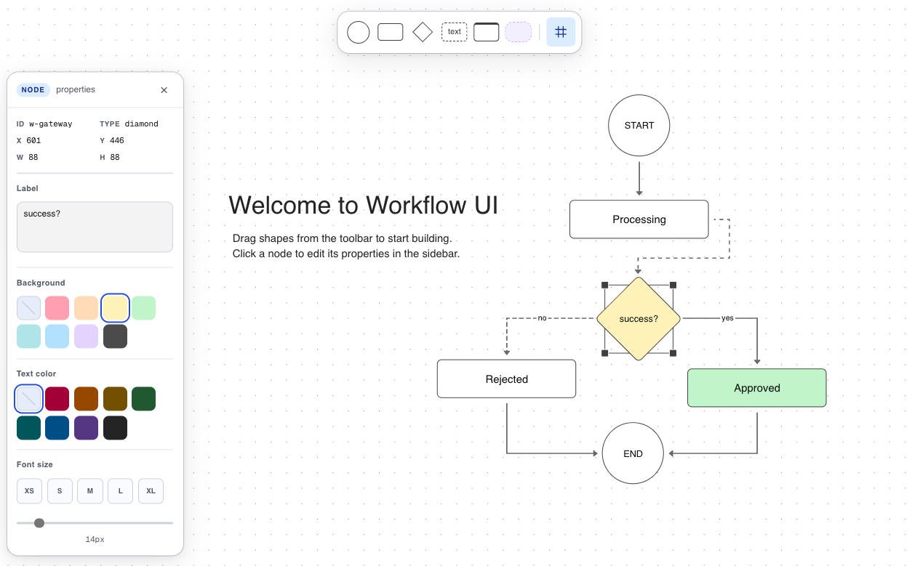

# Workflow UI

Interactive flowchart canvas built with [React Flow](https://reactflow.dev) and Next.js. Drag shapes onto the canvas, connect them with edges, and edit properties via the sidebar.



## Features

- **Node types**: circle, task, diamond, text, card, container
- **Edge controls**: line type, style (solid/dashed/dotted), arrow direction, animated
- **Sidebar**: edit label/content, background color, text color, font size
- **Container nodes**: drag a node onto a container to assign it as a child
- **Duplicate**: `Cmd+D` / `Ctrl+D` to duplicate selected node
- **Flow switcher**: load pre-built diagrams from `data/*.json` via dropdown
- **Autosave**: persists canvas to localStorage with pako compression (69% smaller)
- **Zoom indicator**: shows current zoom % at bottom-center

## Getting Started

```bash
npm install
cp env.example .env.local
npm run dev
```

Open [http://localhost:3000](http://localhost:3000).

## Environment Variables

Copy `env.example` to `.env.local` and adjust:

| Variable | Default | Description |
|---|---|---|
| `NEXT_PUBLIC_MIN_ZOOM` | `0.3` | Minimum zoom level |
| `NEXT_PUBLIC_MAX_ZOOM` | `1.5` | Maximum zoom level |
| `NEXT_PUBLIC_COLOR_MODE` | `light` | Canvas color mode: `light`, `dark`, `system` |
| `NEXT_PUBLIC_INITIAL_FLOW` | _(empty)_ | Flow to load on startup — filename in `data/` without `.json` |
| `NEXT_PUBLIC_AUTOSAVE` | `false` | Persist canvas to localStorage on every change |
| `NEXT_PUBLIC_SHOW_COPY_JSON` | `false` | Show copy-to-clipboard JSON button |
| `NEXT_PUBLIC_SHOW_ZOOM_INDICATOR` | `false` | Show zoom % indicator |
| `NEXT_PUBLIC_SHOW_FLOW_SWITCHER` | `false` | Show flow switcher dropdown in toolbar |

## Adding Flow Diagrams

Drop a `.json` file into `data/` — it auto-appears in the flow switcher dropdown. Schema:

```json
{
  "nodes": [
    {
      "id": "unique-id",
      "type": "circle|task|diamond|text|card|container",
      "data": { "label": "..." },
      "position": { "x": 0, "y": 0 }
    }
  ],
  "edges": [
    {
      "id": "edge-id",
      "source": "node-id",
      "target": "node-id"
    }
  ]
}
```

## API

| Endpoint | Description |
|---|---|
| `GET /api/v1/flows` | List all available flow names |
| `GET /api/v1/flows/[name]` | Get flow JSON by name |

## Autosave

When `NEXT_PUBLIC_AUTOSAVE=true`, any canvas change triggers a debounced save (600ms) to `localStorage['workflow-ui:canvas']` compressed with [pako](https://github.com/nodeca/pako) deflate + base64.

**Load priority on startup:**
1. `NEXT_PUBLIC_INITIAL_FLOW` if set
2. localStorage (if autosave enabled and data exists)
3. `welcome-flow.json` fallback
